# Frontend Mentor - Multi-step form solution

This is a solution to the [Multi-step form challenge on Frontend Mentor](https://www.frontendmentor.io/challenges/multistep-form-YVAnSdqQBJ). Frontend Mentor challenges help you improve your coding skills by building realistic projects.

## Table of contents

- [Overview](#overview)
  - [The challenge](#the-challenge)
  - [Screenshot](#screenshot)
  - [Links](#links)
- [My process](#my-process)
  - [Built with](#built-with)

## Overview

### The challenge

Users should be able to:

- Complete each step of the sequence
- Go back to a previous step to update their selections
- See a summary of their selections on the final step and confirm their order
- View the optimal layout for the interface depending on their device's screen size
- See hover and focus states for all interactive elements on the page
- Receive form validation messages if:
  - A field has been missed
  - The email address is not formatted correctly
  - A step is submitted, but no selection has been made

### Screenshot

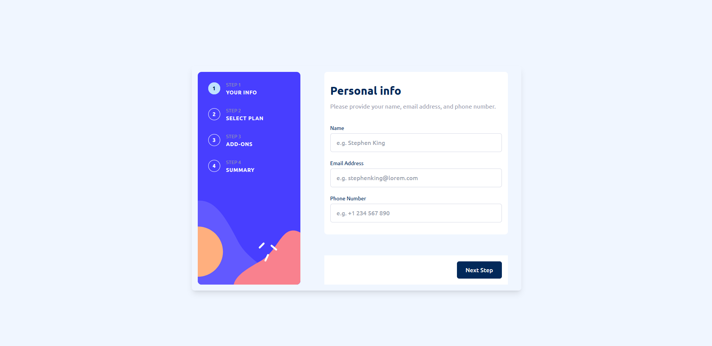
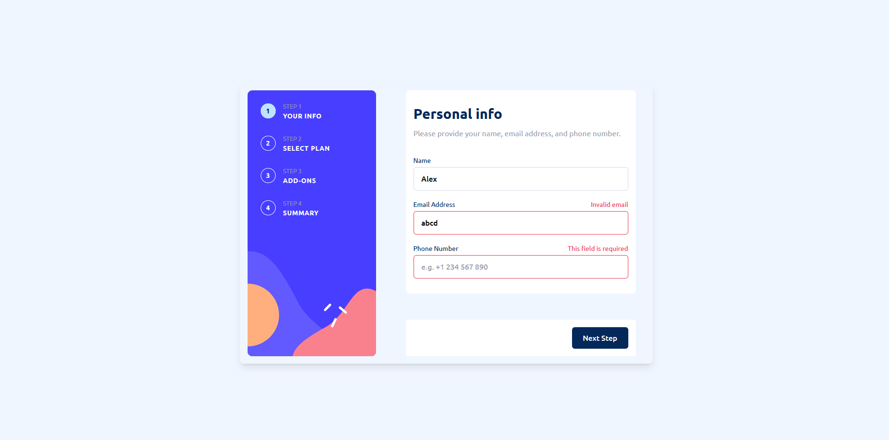
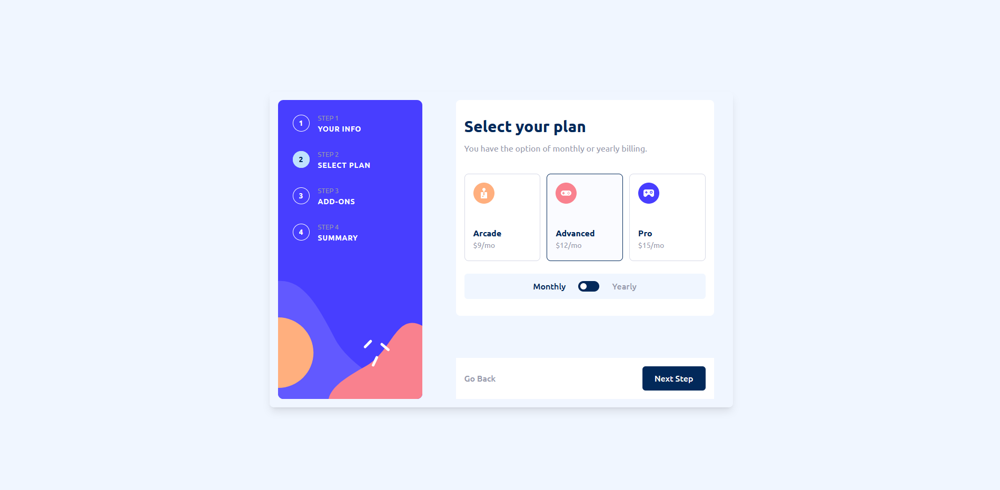
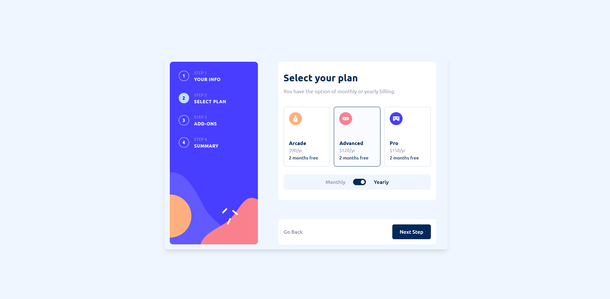
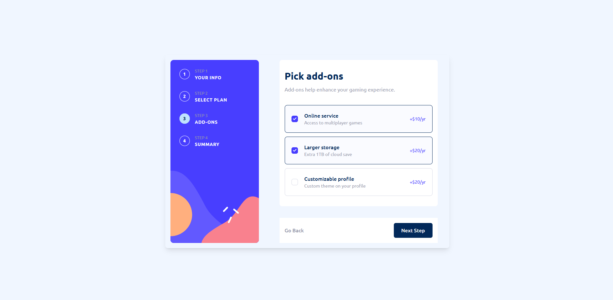
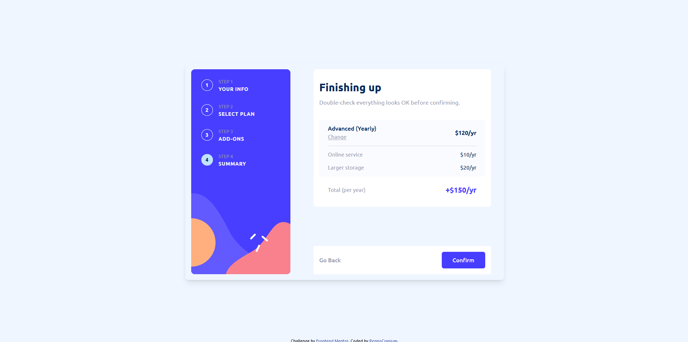
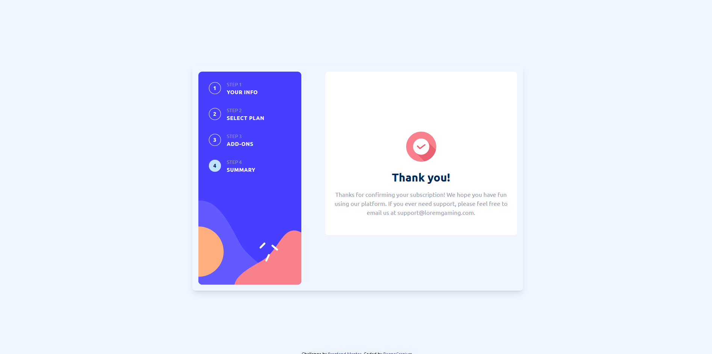
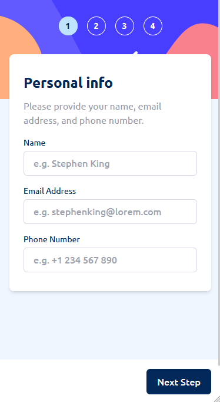
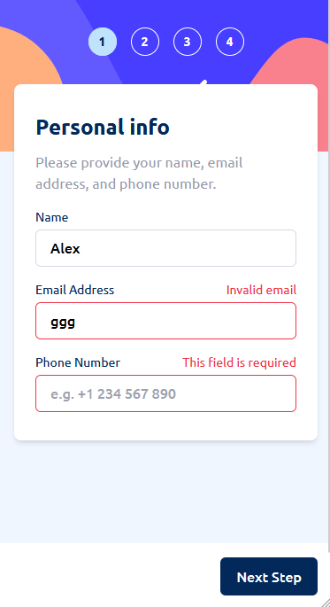
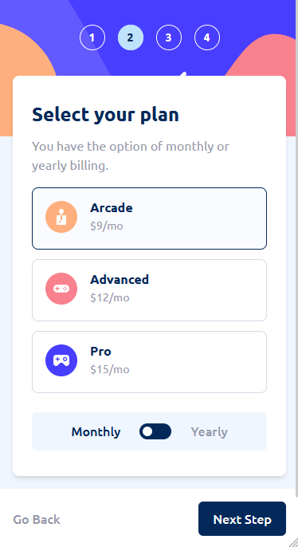
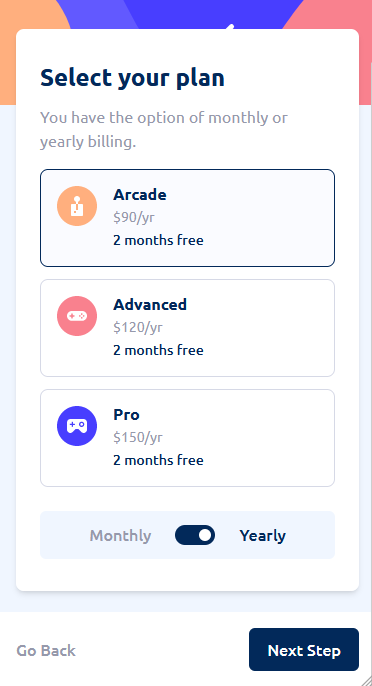
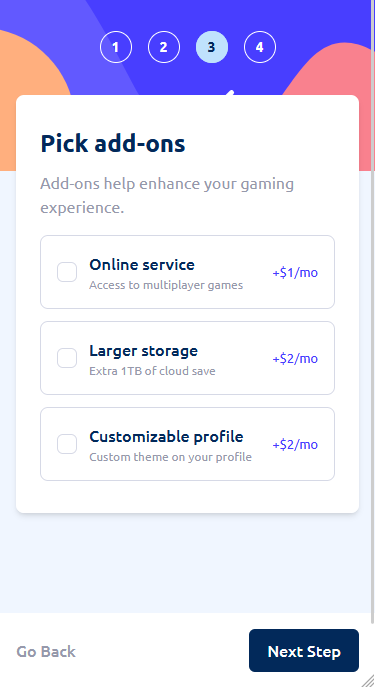
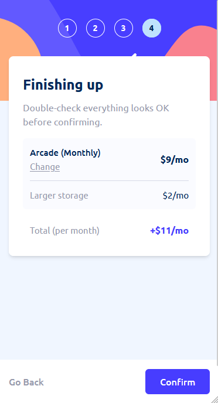
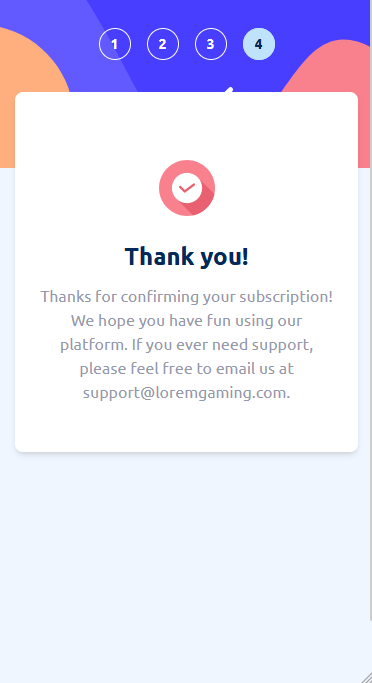

### Links

- Solution URL: [https://github.com/RegnoCranium/frontend-mentor-projects-advanced/tree/main/multi-step-react](https://github.com/RegnoCranium/frontend-mentor-projects-advanced/tree/main/multi-step-react)
- Live Site URL: [https://frontend-mentor-projects-adva-git-34a9eb-regnocraniums-projects.vercel.app](https://frontend-mentor-projects-adva-git-34a9eb-regnocraniums-projects.vercel.app)

## My process

### Built with

- Semantic HTML5 markup
- Flexbox
- Mobile-first workflow
- [React](https://reactjs.org/) - JS library
- [Tailwind](https://tailwindcss.com) - CSS framework
